# Project 1 — Multi-Environment Infrastructure


## Overview

This project provisions three fully isolated environments — **dev**, **staging**, and **production** — on AWS using Terraform workspaces and reusable modules. Each environment is identical in architecture but independently configurable in size, capacity, and cost.

This mirrors how real enterprise teams manage infrastructure at scale — one codebase, multiple environments, zero manual configuration.

---

## Architecture

### Dev Environment
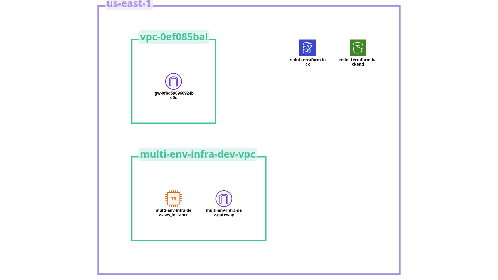

### Staging Environment
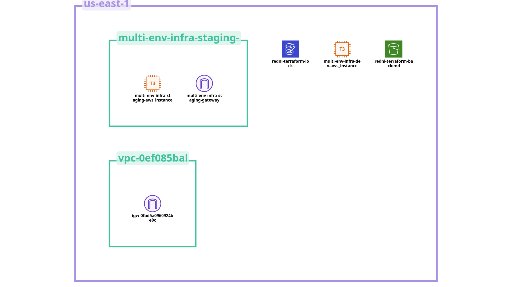

### Production Environment
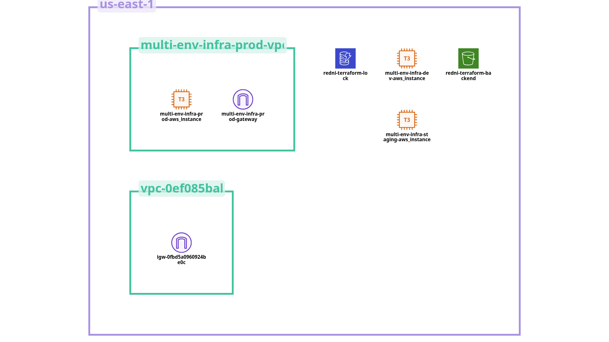

---

## Resources Provisioned Per Environment

| Resource | Dev | Staging | Production |
|---|---|---|---|
| VPC | 10.0.0.0/16 | 10.1.0.0/16 | 10.2.0.0/16 |
| Public Subnet | 10.0.1.0/24 | 10.1.1.0/24 | 10.2.1.0/24 |
| Private Subnet | 10.0.2.0/24 | 10.1.2.0/24 | 10.2.2.0/24 |
| Internet Gateway | ✅ | ✅ | ✅ |
| Route Table | ✅ | ✅ | ✅ |
| Security Group | ✅ | ✅ | ✅ |
| EC2 Instance | t3.micro | t3.small | t3.micro |

---

## Deployment Evidence

### Dev Environment
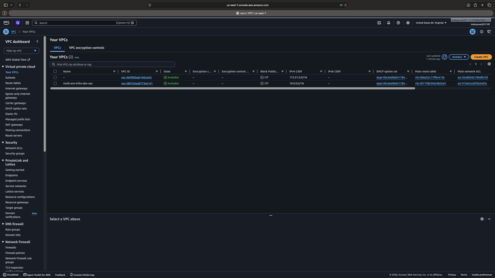
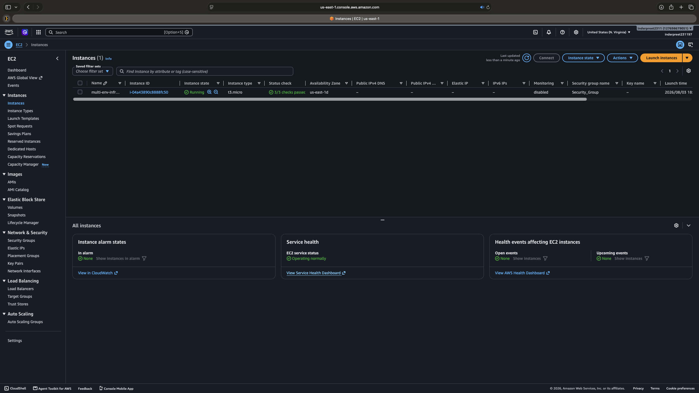

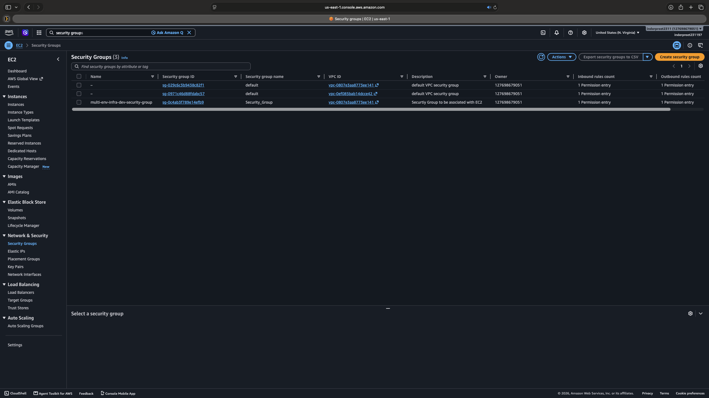

### Staging Environment
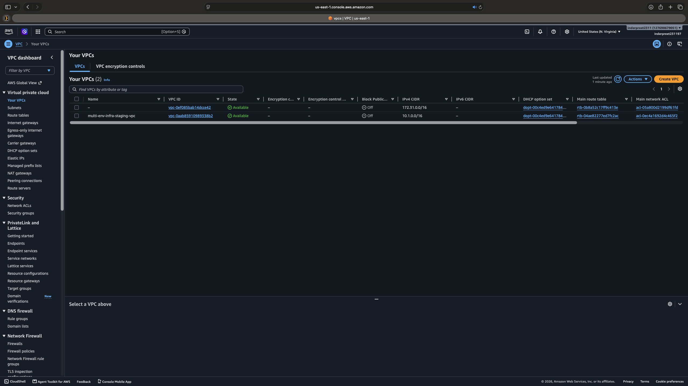
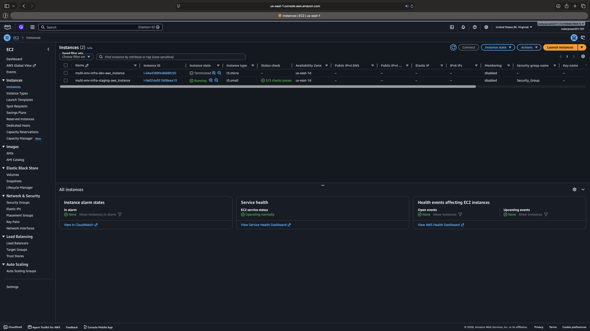

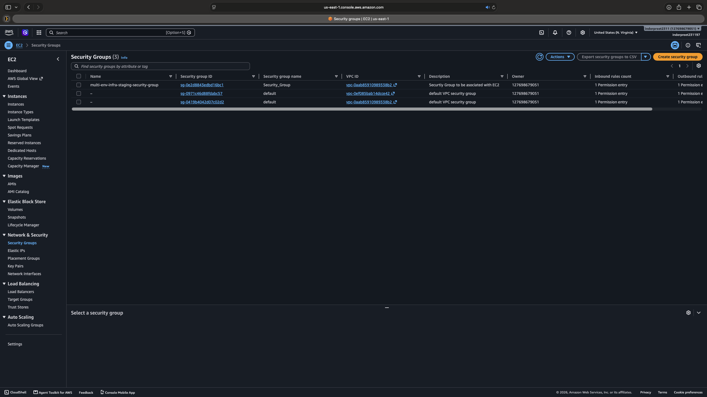

### Production Environment

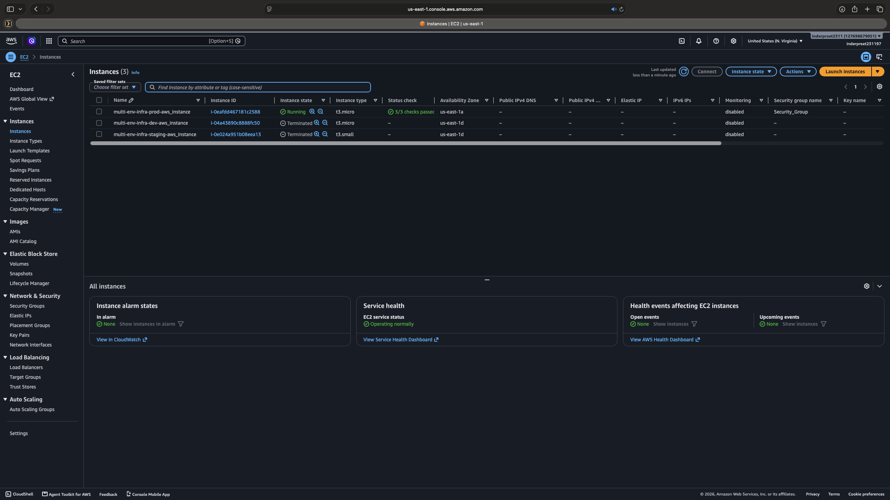
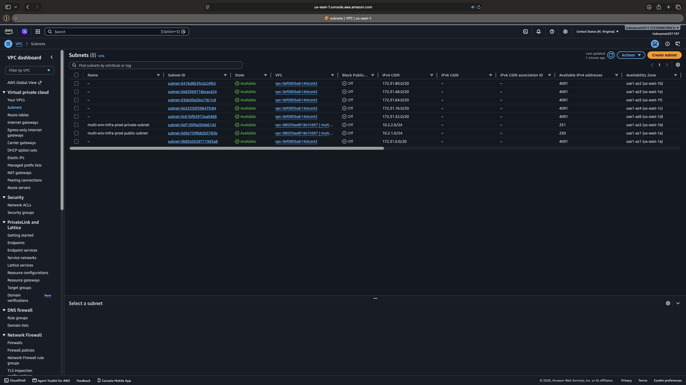


---

## Project Structure

```
project-1-multi-environment/
├── modules/
│   ├── vpc/
│   │   ├── main.tf
│   │   ├── variables.tf
│   │   └── outputs.tf
│   └── ec2/
│       ├── main.tf
│       ├── variables.tf
│       └── outputs.tf
├── environments/
│   ├── dev.tfvars
│   ├── staging.tfvars
│   └── prod.tfvars
├── main.tf
├── variables.tf
├── outputs.tf
├── providers.tf
├── backend.tf
├── locals.tf
├── screenshots/
└── README.md
```

---

## Prerequisites

- [Terraform](https://developer.hashicorp.com/terraform/install) >= 1.5.0
- AWS CLI configured with appropriate credentials
- An S3 bucket for remote state storage
- A DynamoDB table for state locking

---

## Remote State Configuration

This project uses an S3 backend with state locking to manage state safely across environments.

```hcl
terraform {
  backend "s3" {
    bucket       = "your-terraform-state-bucket"
    key          = "project1/terraform.tfstate"
    region       = "us-east-1"
    use_lockfile = true
    encrypt      = true
  }
}
```

---

## How to Deploy

**1. Clone the repository**
```bash
git clone https://github.com/Inderpreet2311/tf-multi-environment-infra.git
cd tf-multi-environment-infra
```

**2. Initialize Terraform**
```bash
terraform init
```

**3. Create and select a workspace**
```bash
terraform workspace new dev
terraform workspace select dev
```

**4. Plan the deployment**
```bash
terraform plan -var-file="environments/dev.tfvars"
```

**5. Apply the configuration**
```bash
terraform apply -var-file="environments/dev.tfvars"
```

**6. Destroy resources when done**
```bash
terraform destroy -var-file="environments/dev.tfvars"
```

Repeat steps 3–6 using `staging` or `prod` workspace and the corresponding `.tfvars` file.

---

## Key Concepts Demonstrated

- **Terraform Workspaces** — isolating state per environment using a single codebase
- **Reusable Modules** — writing VPC and EC2 modules once, consuming them across all three environments
- **Remote State** — S3 backend with file locking, mirroring real enterprise setup
- **Environment Specific Variables** — separate `.tfvars` files per environment with different CIDR ranges and instance types
- **Resource Tagging** — every resource tagged with environment, project, and owner using locals
- **Provider Version Pinning** — reproducible deployments across team members
- **Availability Zone Control** — subnets explicitly pinned to specific AZs for consistency

---

## Real World Lessons Learned

- AWS does not support all instance types in all availability zones. Explicitly setting `availability_zone` in subnet resources prevents random AZ assignment and deployment failures.
- Terraform workspaces isolate state completely — destroying dev has zero impact on staging or prod state files.
- Remote state with locking prevents concurrent apply conflicts in team environments.
- The `terraform fmt -recursive` command enforces consistent formatting across all module subdirectories.
- Running `terraform plan` before every apply is non-negotiable — it caught configuration issues before they hit AWS.

---

## Author

**Inder** — IT Operations transitioning to Cloud Engineering
[LinkedIn](https://linkedin.com/in/your-profile) | [GitHub](https://github.com/Inderpreet2311)

---

## License

MIT License — feel free to use this as a reference for your own projects.
